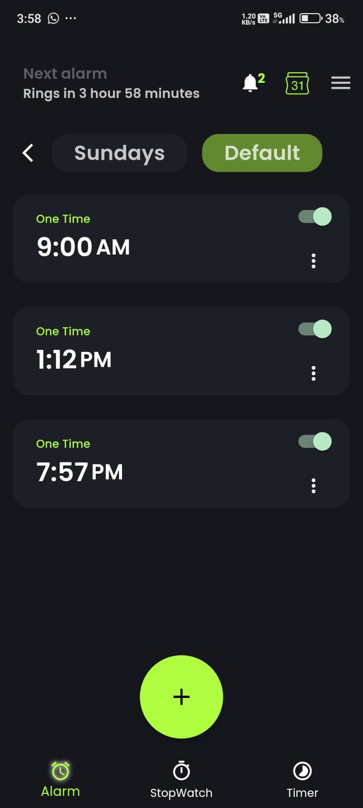

# Ultimate Alarm Clock

This project aims to build a non-conventional alarm clock with smart features such as auto-dismissal based on phone activity, weather and  more! It also includes challenges to ensure you completely wake up and an option to set shared alarms! This is the ULTIMATE alarm clock :)

## Google Summer of Code'24
_Name : Aryan Saraf_  
_Project : [Link to GSOC Project](https://github.com/CCExtractor/ultimate_alarm_clock)_  
_Slack : [Link to Slack ID](https://rhccgsoc15.slack.com/team/U06QWS1QC95)_  
_GitHub Username : [AryanSarafDev](https://github.com/AryanSarafDev)_  
_Mentor: [Rijuth Menon](https://github.com/MarkisDev)_  
  
## Table of Contents
- [What's new (GSOC'24)](#what's-new)
- [Future Plans](#future-plans)
- [Community](#community)
- [Flutter](#flutter)

## What's New?
During the GSOC'24 period, the following features were implemented by Contributor Aryan Saraf:

### 1) Migrating Alarm Scheduling logic and Smart Controls logic to Kotlin
The previous alarm scheduling logic and smart controls would launch the app when working in the background due to reliance on Flutter method channels for database access and functions. To resolve this, we have migrated the Alarm Scheduling and Smart Controls logic from Flutter to Kotlin.
Pull-Requests: [#563](https://github.com/CCExtractor/ultimate_alarm_clock/pull/563) [#574](https://github.com/CCExtractor/ultimate_alarm_clock/pull/574) [#580](https://github.com/CCExtractor/ultimate_alarm_clock/pull/580) 

### 2) Cross-communication between Flutter and Kotin
Switching to SQLite databases will enhance cross-language data accessibility and streamline native feature integration. Earlier, we used Method Channels to extract data from the ISAR database for scheduling alarms upon booting, which triggers MainActivity and launches the app from the background. Transitioning to SQLite will improve flexibility and adaptability for future developments as it can be directly used by Kotlin.
Issue: [#562](https://github.com/CCExtractor/ultimate_alarm_clock/issues/562), Pull-Request: [#563](https://github.com/CCExtractor/ultimate_alarm_clock/pull/563)

### 3) Profile Switcher and Alarm/Profile Sharing
Effortlessly manage and share custom alarm profiles for different days and occasions, ensuring only the active profile’s alarms are prioritized. Alarms and profiles can now be shared with other users using their emails. In-app notifications for received alarms and profiles with the option to either accept or reject them.
Issue: [#591](https://github.com/CCExtractor/ultimate_alarm_clock/issues/591), Pull-Request: [#584](https://github.com/CCExtractor/ultimate_alarm_clock/pull/584)

 

### 4) Google Calendar Integration and Date-based Scheduling
Integrate Google Calendar to import reminders, events and aggregate alarms. Users can now create alarms that can be triggered on a specific date
Issue: [#590](https://github.com/CCExtractor/ultimate_alarm_clock/issues/590), Pull-Request: [#584](https://github.com/CCExtractor/ultimate_alarm_clock/pull/584)

 

### 5) Guardian Angel
Set a Guardian Angel to send a call or SMS to if you fail to wake up for important events, ensuring you never miss crucial moments.
Issue: [#592](https://github.com/CCExtractor/ultimate_alarm_clock/issues/592), Pull-Request: [#584](https://github.com/CCExtractor/ultimate_alarm_clock/pull/584)

 
 

### 6) Anti-disturbance
Automatically dismiss alarms if the user’s screen is on for more than X minutes, indicating they are busy and don’t need the alarm.”
Issue: [#572](https://github.com/CCExtractor/ultimate_alarm_clock/issues/572), Pull-Request: [#574](https://github.com/CCExtractor/ultimate_alarm_clock/pull/574)

### 7) Open-meteo integration and weather fetch logic shift to Kotlin, Location access notification
Switch to Open-Meteo for weather API for seamless weather integration without the need for an API key, reducing setup friction and streamlining the user experience. Add Notification for user location being accessed in the background. Weather and Location-based smart controls logic shifted to Kotlin.
Issue: [#579](https://github.com/CCExtractor/ultimate_alarm_clock/issues/579), Pull-Request: [#580](https://github.com/CCExtractor/ultimate_alarm_clock/pull/580)

### 8) Timer
Revamped the timer with multiple timer support, an easy-to-use UI, notification display when minimized, and direct Kotlin database access for faster performance without relying on Flutter for data.
Issue: [#564](https://github.com/CCExtractor/ultimate_alarm_clock/issues/564), Pull-Request: [#565](https://github.com/CCExtractor/ultimate_alarm_clock/pull/565)

 
 
 

### 9) Ringtones
“Added 5 new royalty-free ringtones and fixed related bugs, including erratic ringtone preview behaviour.”
Issue: [#595](https://github.com/CCExtractor/ultimate_alarm_clock/issues/595), Pull-Request: [#596](https://github.com/CCExtractor/ultimate_alarm_clock/pull/596)

### 10) UI and bug fixes
- Fixed Scheduling logic for weekday scheduling.
- Fixed Several Controller errors throughout different PRs.
- New UI for alarm and profile setting screen.
- Fixed existing Firebase Auth implementation.

## Future Plans

#### Google Assistant commands

- We want to add Google Assistant commands to set alarms directly without the need to open the app.
  
#### Google Cloud Functions

- We are working on implementing Google Cloud functions to make shared alarms more interactive by allowing users to disable or reconfigure alarms for others.
  
#### Architectural and Data Flow Changes

- We have plans to make architectural and data flow changes within the application to enhance its overall performance and maintainability. These changes will optimize resource utilization and streamline the user experience.

## Community

We would love to hear from you! You may join the CCExtractor community through Slack:

## Flutter

For help in getting started with Flutter, view
[online documentation](https://flutter.dev/docs), which offers tutorials,
samples, guidance on mobile development, and a full API reference.
